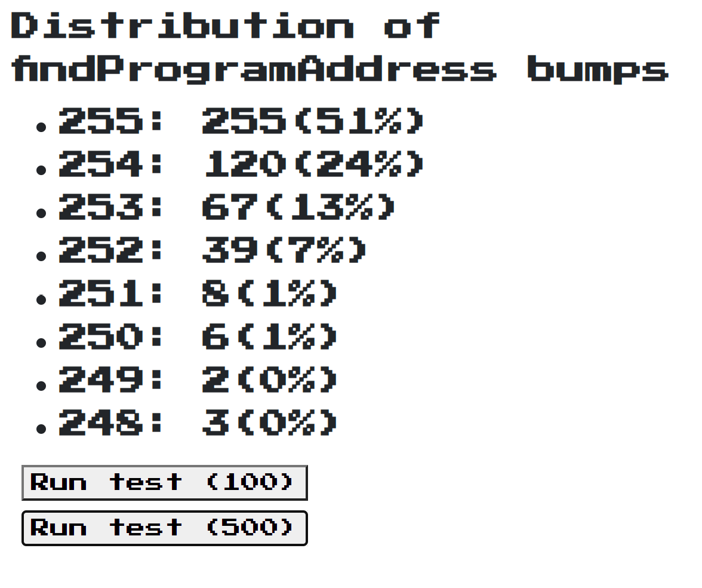

There's some frequent misunderstanding when it comes to PDA's on Solana, starting with the 'bump' value.

First, let's look at what makes up a PDA. A PDA, or Program Derived Address, is an address on Solana that satifies two requirements.

1. "Program address must not lie on the ed25519 curve to ensure there is no associated private key" - This means that there's no corresponding private key for the public address; no one will ever be able to sign a transaction with this key. What are the odds of that happening? It turns out that randomly generating a new keypair on ed25519 results in a valid pair 50% of the time. We'll get to this later.

2. The PDA needs to have some tie to its program owner. We achieve this by always using the program's address as a seed to generate the PDA address. Regardless of what other seeds you decide to include (eg. the token holders address), since it always includes with the program's address, it's essentially locked to that particular program.

Let's look at the code

```rust
static async findProgramAddress(
    seeds: Array<Buffer | Uint8Array>,
    programId: PublicKey,
): Promise<[PublicKey, number]> {
    let bump = 255;
    let address;
    while (bump != 0) {
        try {
        const seedsWithBump = seeds.concat(Buffer.from([bump]));
        address = await this.createProgramAddress(seedsWithBump, programId);
        } catch (err) {
        if (err instanceof TypeError) {
            throw err;
        }
        bump--;
        continue;
        }
        return [address, bump];
    }
    throw new Error(`Unable to find a viable program address bump`);
}
```

You can see the structure pretty clearly, and if you put it all together you end up with seed that looks like

```
["MyFirstSeed", "AnotherSeed", bump]
```

And if that doesn't result in a valid PDA (no valid private key) we decrement bump (which starts at 255) and try again.

Finally, let's dive into the 'createProgramAddress' to see the full structure and hashing:

```rust
static async createProgramAddress(
    seeds: Array<Buffer | Uint8Array>,
    programId: PublicKey,
): Promise<PublicKey> {
    let buffer = Buffer.alloc(0);
    seeds.forEach(function (seed) {
        if (seed.length > MAX_SEED_LENGTH) {
        throw new TypeError(`Max seed length exceeded`);
        }
        buffer = Buffer.concat([buffer, toBuffer(seed)]);
    });
    buffer = Buffer.concat([
        buffer,
        programId.toBuffer(),
        Buffer.from('ProgramDerivedAddress'),
    ]);
    let hash = sha256(new Uint8Array(buffer)).slice(2);
    let publicKeyBytes = new BN(hash, 16).toArray(undefined, 32);
    if (is_on_curve(publicKeyBytes)) {
        throw new Error(`Invalid seeds, address must fall off the curve`);
    }
    return new PublicKey(publicKeyBytes);
}

```

So now we see the whole seed which gets hashed to create a potential PDA:

```
["MySeed", "AnotherSeed", bump, programAddress, "ProgramDerivedAddress"]
```

On the validator side of things, when my program wants to sign a transaction, it simply supplies the seeds and the bump, and the validator runs it through this instruction along with the program address and confirms that it matches the PDA I'm asking to sign for.

## Distribution

Ok, so let's actually look at the distribution and verify this is happening as often as predicted. [I built a quick demo on CodeSandbox to randomly generate PDA's and aggregate the bumps returned for each one](https://codesandbox.io/s/findprogramaddress-distribution-et07bv). Remember, each time we attempt to generate a random PDA, it should be valid 50% of the time. Which means we should see ~50% of bumps at 255, ~25% at 254, ~12.5% at 253 and so on.

And here's the result:



Hopefully, this helps clear up what's happening behind the scenes when we use findProgramAddress.
